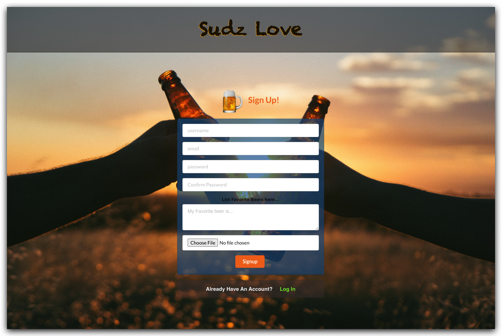
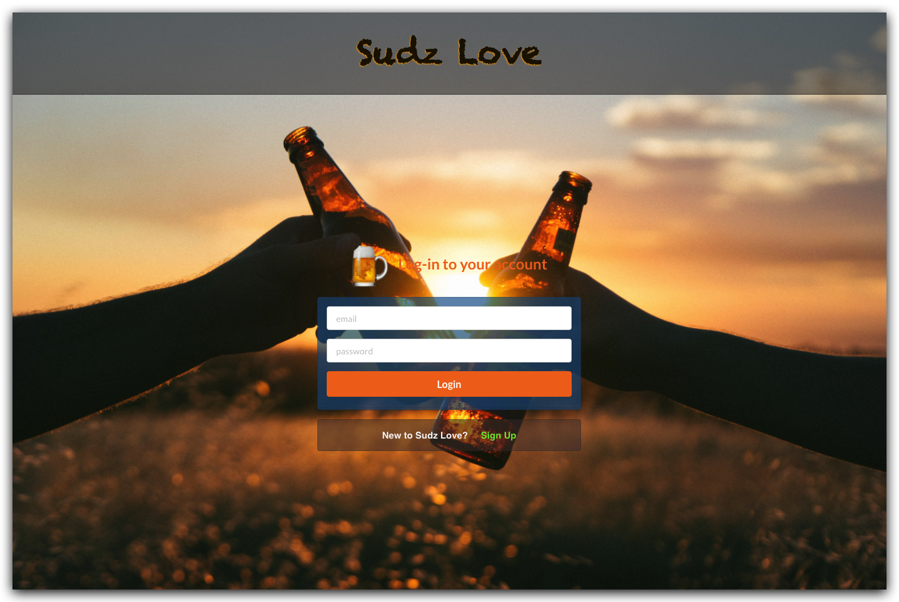

# Sudz Love
Sometimes your so satisfied with a beer you can't help but want to tell people about it. 
Maybe you can't remember the name of the beer the morning after...

Whatever the reason may be you've come to the right place!
- Post your beer and share it with the world.
- When its time to go brew hopping search for a brewery near by and check out whats on their menu.

## Screenshots

## Technologies Used
* Javascript/CSS/JSX
* MongoDB/Mongoose
* Express
* React
* Node
* Heroku
* Open Brewery DB API

## Getting Started
Check out Sudz Love here: [Sudz Love](https://sudzlove.herokuapp.com/)

Check out my Trello board : [Sudz Love Trello](https://trello.com/b/gSR8OJf1)

## Next Steps
* Implement an alternative third party API for searching beers.
* Implement map integration to display breweries in the area.
* Edit beer posts and profile page information.
* Ability to comment beer posts.